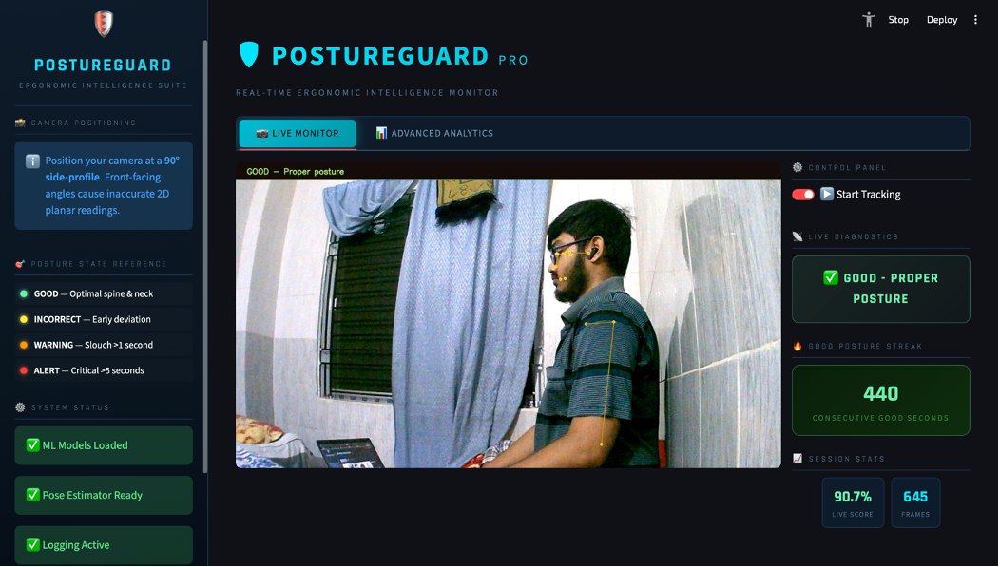
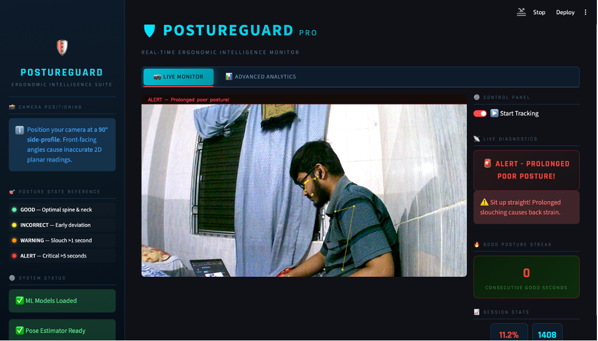
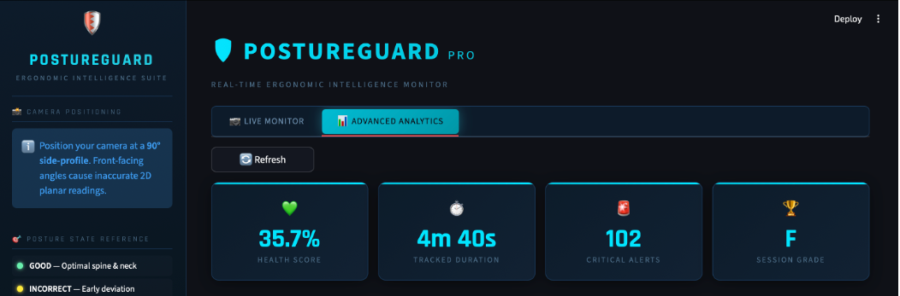
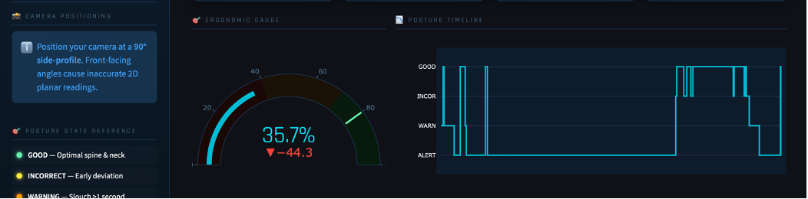

# PostureGuard Pro 🛡️
### AI-Powered Ergonomic Posture Monitoring System

PostureGuard Pro is a non-invasive, cost-effective, real-time posture monitoring system designed for desk-bound workers. Built entirely with open-source tools, it utilizes a standard USB webcam, Google MediaPipe Pose estimation, and a custom-trained Random Forest classifier to analyze sitting alignment and provide real-time behavioral insights.

---

## 🚀 System Architecture Overview

The PostureGuard framework processes raw visual inputs through five core logical stages:

1. **Image Acquisition:** Captures real-time frames using a standard webcam positioned at a 90° side profile.
2. **Pose Estimation:** Google MediaPipe Pose maps 33 anatomical body landmarks in 3D space.
3. **Feature Extraction:** Computes 4 domain-specific biomechanical angles and ratios normalized by torso length to maintain scale independence.
4. **Classification:** A pre-trained Random Forest model categorizes posture into 4 continuous stages.
5. **Feedback & Dashboard Logging:** Visualizes real-time metrics onto an interactive dark-themed Streamlit application and appends records to a CSV log

---

## Key Features 🚀

* 🌐 **Real-time Data Monitoring:** Utilizes a standard webcam and MediaPipe to detect 33 body landmarks and analyze posture alignment instantly.
* 🤖 **AI Posture Classification:** A custom-trained Random Forest model classifies posture into four distinct states: Good, Incorrect, Warning, and Alert.
* 📊 **Advanced Analytics Dashboard:** Features interactive Plotly charts, including a posture timeline and a state distribution donut chart.
* 📈 **Biomechanical Feature Extraction:** Computes spine angle, torso lean, and neck compression ratios that are invariant to camera distance.
* ⏱️ **Time-Aware Alerts:** Distinguishes between momentary movements and sustained poor posture to reduce false alarm fatigue.
* 📄 **Exportable Health Reports:** Generates comprehensive PDF ergonomic reports with personalized health recommendations.
* 🎮 **Gamified Experience:** Track your progress with a "Good Posture" streak counter that encourages long-term alignment habits.

---

## 📊 Posture States & Logic Matrix

| State | Color Code | Condition | Meaning |
| :--- | :--- | :--- | :--- |
| **GOOD** | `#69F0AE` (Green) | Model predicts 'good' | Optimal spine and neck alignment maintained |
| **INCORRECT** | `#FFEB3B` (Yellow) | Bad posture < 1s[cite: 2] | Early postural deviation detected |
| **WARNING** | `#FF9800` (Orange) | Bad posture > 1s[cite: 2] | Slouch exceeds threshold; correction advised |
| **ALERT** | `#F44336` (Red) | Bad posture > 5s[cite: 2] | Critical prolonged poor posture; alert triggered |

---

## 🛠️ Biomechanical Feature Engineering

The analytical engine extracts four normalized, dimensionless features using 2D coordinate projections to eliminate Monocular Z-axis depth noise:

1. **Spine Angle:** 2D angle spanning Ear $\rightarrow$ Shoulder $\rightarrow$ Hip. Approaches $180^\circ$ under standard positioning.
2. **Torso Lean:** 2D angle spanning Shoulder $\rightarrow$ Hip $\rightarrow$ Vertical axis.
3. **Forward Head Ratio:** Horizontal displacement between ear and shoulder normalized by torso length.
4. **Neck Compression Ratio:** Euclidean distance between ear and shoulder normalized by torso length.

---

## 📈 System Performance

### Machine Learning Classifier
* **Algorithm:** Random Forest Classifier (Ensemble of 300 Decision Trees; Max Depth = 20).
* **Dataset:** Custom self-collected dataset across real subjects.
* **Model Evaluation:** Achieved **93% Classification Accuracy**, with highly balanced precision and recall metrics.

### Latency & Throughput
* **Frame Processing Latency:** `< 50 ms` per frame on a standard laptop CPU
* **MediaPipe Inference Speed:** `~20-30 FPS`
* **ML Inference Execution:** `< 1 ms` per frame

---

## Screenshots 🌟

### 1. PostureGuard Dashboard - Real-time Data Overview

### 2. Live Tracking - Alert State Escalation

### 3. Advanced Analytics - Ergonomic Insights

### 4. Statistical Distributions & Session Exports

### 5. Comprehensive Session Reports - PDF Export

---

## ⚙️ Tech Stack & Dependencies

* **Core Language:** Python 3.x[cite: 2]
* **Computer Vision & Pose Assessment:** Google MediaPipe, OpenCV (cv2)
* **Machine Learning Infrastructure:** Scikit-Learn, NumPy, Joblib
* **Web UI & Visualization:** Streamlit, Plotly, Pandas
* **Document Generation Engine:** ReportLab

---
